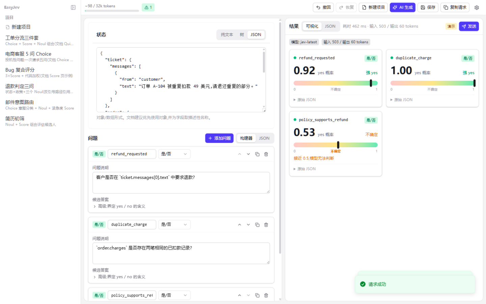
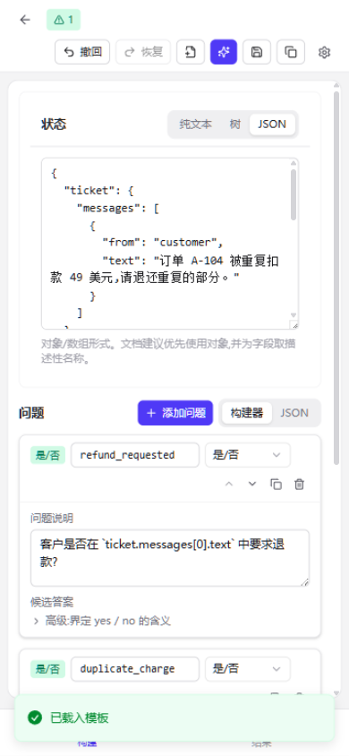
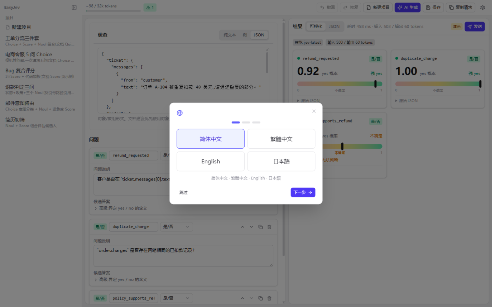
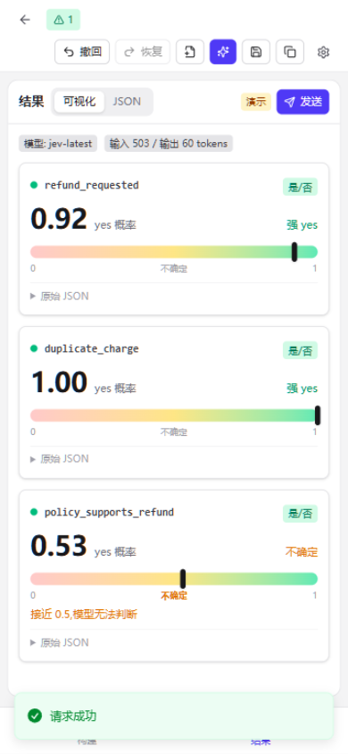

<div align="center">

# PlayJev

**Visual IDE for [Jev](https://docs.typesafe.ai/introduction) (TypeSafe System One) API inputs**

Compose `state` + typed questions (Choice / Score / Noul), preview the request JSON,
validate, send — and read the answers as **visual cards**, not raw JSON.
Any LLM can draft the whole request from one sentence.

[](LICENSE)
[](https://nodejs.org)
[](docker-compose.yml)
[](wrangler.toml)
[](#-features)

[中文版](./README.zh-CN.md) · [Getting Started](#-quick-start) · [Deployment](#-deployment) · [Design](./DESIGN.md) · [Docs mirror](./docs/jev/README.md)

</div>

---

## ✨ Preview

| Desktop | Mobile |
| --- | --- |
|  |  |
|  |  |

## 🚀 Features

| Area | What you get |
| --- | --- |
| 🖥️ Dual-pane IDE | Build request (state: text / visual tree / JSON; questions: builder ⇄ JSON) on the left, read results (visual cards ⇄ JSON) on the right |
| 🧪 Playground | Paste a Jev API key and hit Send — traffic goes through a built-in same-origin proxy (no CORS pain), with automatic 429/529 backoff |
| 🤖 AI wizard | One sentence → clarifying questions (with free-text input) → full draft → apply to editor or copy the Schema straight to your coding Agent |
| 🌍 i18n | 简体中文 / 繁體中文 / English / 日本語 / Deutsch / Français |
| 📦 Ready to use | Preset templates, undo/redo, silent persistence, import/export, first-run wizard, responsive desktop + mobile layouts |

## ⚡ Quick start

```bash
npm install          # first-time setup
npm run dev          # local dev → http://localhost:5173
npm start            # single-process server → http://localhost:8787
npm test             # unit tests
npm run build        # production build → apps/web/dist
```

Get a key at [console.typesafe.ai](https://console.typesafe.ai/keys), paste it under
Settings → Jev API, and press Send. That's it — the reverse proxy needs no configuration.

## 🐳 Deployment

```bash
docker compose up -d --build
# open http://localhost:10010 (override with PLAYJEV_PORT)
```

| Target | How | Reverse proxy |
| --- | --- | --- |
| Docker Compose | `docker compose up -d --build` | ✅ single Bun container, zero config |
| Cloudflare Workers | `npx wrangler deploy` | ✅ `server/worker.ts` (static + `/api/*`) |
| Cloudflare Pages | build `npm run build`, output `apps/web/dist` | ✅ `functions/api/*` auto-attached |
| Node single-process | `npm run build && npm start` | ✅ built into `server/proxy.mjs` |
| Static-only hosts | dist works, **Send does not** (TypeSafe blocks browser CORS) | ❌ use one of the above instead |

All API traffic is pinned to same-origin `/api/jev/systemone` and `/api/llm` —
direct browser calls and custom proxy settings were removed on purpose.
See [DESIGN.md](./DESIGN.md) for the architecture.

## 🗺️ Project layout

```
packages/core/    @playjev/core — platform-agnostic logic (types, zod, lint,
                  token estimate, state-tree ops, templates, i18n, LLM/Jev clients)
apps/web/         @playjev/web — Vite + React + Tailwind web IDE (dev proxy plugin included)
server/proxy.mjs  single-process server: serves apps/web/dist + /api/* proxy
server/worker.ts  Cloudflare Workers edge proxy (static assets + /api/*)
functions/api/    Cloudflare Pages proxy (jev/systemone.ts + llm.ts)
docs/jev/         TypeSafe official docs mirror (Markdown, Sep 2026)
```

Mobile (Expo) and desktop (Tauri) shells reuse `@playjev/core` — tracked as P2 in [DESIGN.md](./DESIGN.md).

## 🙏 Acknowledgements

- [TypeSafe AI](https://typesafe.ai) — the Jev model and its excellent docs
- [LinuxDo](https://linux.do) community — inspiration and early feedback
